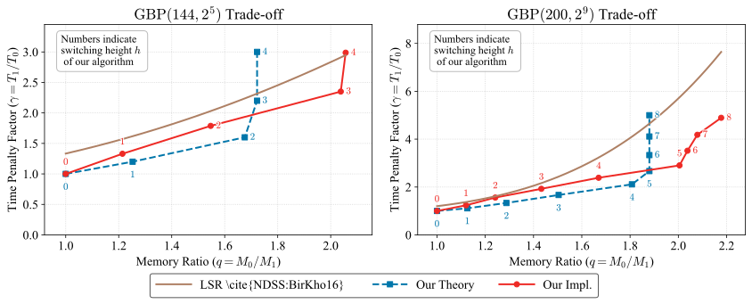
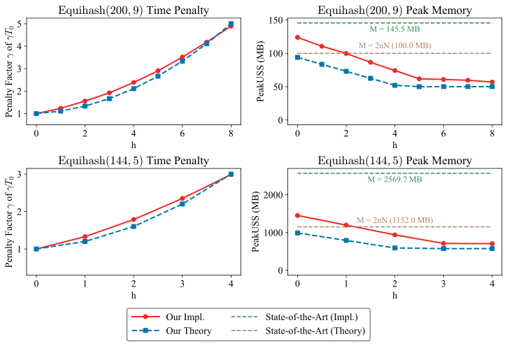

# Wagner-Algorithms

New memory optimizations for Wagner's algorithms and Equihash accompanying the paper: "New Memory Optimizations of Wagner’s Algorithms via List Item Reduction". 

## New Memory Optimizations of Wagner's Algorithms

We propose two new techniques to optimize Wagner's algorithms:

- **Improved Index-Trimming Technique**: Reduces memory usage by trimming indexes for both the single-chain and $k$-tree algorithms implemented with index vectors.
- **Post-Retrival Technique**: Reduces memory usage by reconstructing the index pointers for single-chain algorithm implemented with index pointers. It's not memory-efficient for the $k$-tree algorithm.

All of these optimizations rely on our newly proposed in-place $`\textsf{merge}`$ framework. Theoretically, our techniques can reduce the peak memory usage of Wagner's algorithm by half (from $`2nN`$ to $`nN`$ bits) across most parameter settings, while incurring no more than a twofold time penalty. For example, the figure below shows that our new advanced post-retrieval technique achieves an almost linear time–memory trade-off curve, which is strictly better than the curve obtained by existing List Size Reduction (LSR) techniques.

> The above LSR curve is not applicable to algorithm-bound Equihash, whereas our algorithm is.

> For the LSR curve above, the reason why the time penalty is slightly above 1 when q=1 is that their baseline algorithm differs from the standard Wagner algorithm.

Under the hybrid framework, the memory footprint can be further reduced (below $`nN`$ bits, i.e., q < 0.5) at the cost of additional computational overhead. 

<!-- 
For example, under the hybrid technique, the optimal parameter choices are as follows.
| (n,k)   | plain peak mem | peak mem |  runtime | switching height1 | switching height2 | peak layer |
| ------- | -------------: | -------: | -------: | ----------------: | ----------------: | ---------: |
| (96, 5) |        2^24.39 |  2^23.04 | 3.8 * T0 |                 1 |                 3 |          4 |
| (128,7) |        2^24.88 |  2^23.64 | 3.9 * T0 |                 1 |                 4 |          6 |
| (160,9) |        2^25.25 |  2^24.07 | 4.0 * T0 |                 1 |                 5 |          8 |
| (96, 3) |        2^32.21 |  2^30.64 | 4.0 * T0 |                 1 |                 2 |          1 |
| (144,5) |        2^32.95 |  2^31.61 | 3.8 * T0 |                 1 |                 3 |          4 |
| (150,5) |        2^34.01 |  2^32.67 | 3.8 * T0 |                 1 |                 3 |          4 |
| (192,7) |        2^33.44 |  2^32.21 | 3.9 * T0 |                 1 |                 4 |          6 |
| (240,9) |        2^33.81 |  2^32.63 | 4.0 * T0 |                 1 |                 5 |          8 |
| (96, 2) |        2^40.02 |  2^39.00 | 1.5 * T0 |                 0 |                 1 |          1 |
| (288,8) |        2^42.04 |  2^41.00 | 2.9 * T0 |                 0 |                 5 |          1 |
| (200,9) |        2^29.55 |  2^28.38 | 4.0 * T0 |                 1 |                 5 |          8 |
-->

More estimators and resluts are available in [python-poc](./python-poc/). A lower–time-penalty implementation can be found in the next section.

## Implementations

Our implementation serves solely as a proof of concept and does not incorporate aggressive low-level optimizations. We also note that these optimizations may significantly impact the ASIC-resistance of existing blockchains that rely on $`\textsf{Equihash}`$. We therefore recommend that such blockchains reassess the memory bottlenecks of ASIC implementations across all $`\textsf{Equihash}`$ parameter settings. 

### Advanced Post-Retrieval with Different Switching Heights

> Details are available in the directories [eq1445](./eq1445/).

### Equihash(144,5) Quick Benchmark

For the parameter setting $`\textsf{Equihash}(144, 5)`$, a subset of our optimization results is shown below (serving only as a proof of concept). Our implementations outperform Tromp's baseline implementation (CIP) in both time and memory usage.

| Algorithm      | Sol/s | Avg single run (s) | Total solutions | Peak USS (MB) |
| -------------- | ----: | -----------------: | --------------: | ------------: |
| CIP            |  0.23 |               8.50 |             198 |       1733.00 |
| CIP-PR         |  0.08 |              25.24 |             198 |        706.69 |
| CIP-EM         |  0.22 |               9.17 |             198 |        707.45 |
| Tromp-Baseline |  0.20 |               9.20 |             190 |       2569.71 |

> Notes: "Avg single run (s)" is the average per-iteration runtime reported by the benchmark (for Tromp the total time was divided by 100 iterations to obtain the per-run average).

### Equihash(200,9) Quick Benchmark

For the parameter setting $`\textsf{Equihash}(200, 9)`$, a subset of our optimization results is shown below (serving only as a proof of concept).

| Algorithm   | Sol/s | Peak USS (MB) |
| ----------- | ----- | ------------- |
| CIP         | 2.12  | 155.82        |
| CIP-PR      | 0.44  | 58.24         |
| CIP-EM      | 1.93  | 58.67         |
| CIP-APR5    | 0.74  | 63.11         |
| Tromp-Equi1 | 6.30  | 145.54        |

> CIP-APR5 refers to the advanced post-retrieval technique with switching height set to 5.
> CIP-EM requires external memory which in practice may be highly advantageous for ASIC implementations.

**Remark.** As the runner-up in the Zcash miner optimization contest (see https://zcashminers.org/submissions), Tromp’s implementation of $`\textsf{Equihash}(200,9)`$ incorporates numerous carefully engineered optimizations, including the choice of near-optimal bucket sizes, layer-specific tuning of $`\textsf{merge}`$ functions, and compact index-pointer representations. The winning implementation applied even more aggressive low-level optimizations, such as hand-crafted assembly and architecture-specific tuning.
In contrast, our work does not aim to produce a highly optimized or practically competitive $`\textsf{Equihash}`$ solver. This performance gap is therefore **an engineering issue rather than a conceptual one**. Our implementation is sufficient to demonstrate the effectiveness of the new algorithmic techniques proposed in this work, and the results clearly validate the improvements our methods bring.

> Further details can be found in the directory [eq2009](./eq2009/).

## TODO

- [ ] Refactor the codebase for better readability and modularity.
- [ ] Implement hybrid single-chain algorithms. See our on-going development branch [dev-hybrid](https://github.com/tl2cents/Wagner-Algorithms/tree/dev-hybrid).